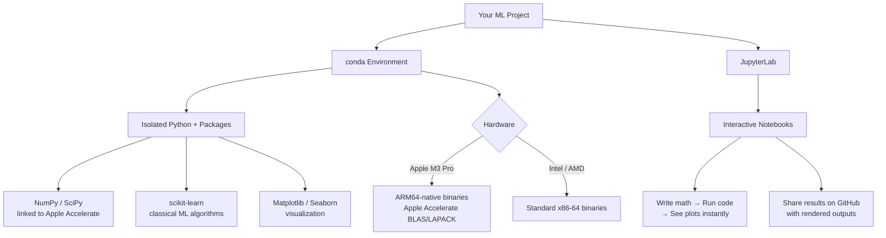
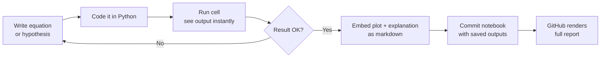

# ML Training Journey 🎓

> Learning machine learning from the ground up — mathematics first, code second.
> **Stack:** Python 3.11 · NumPy · Matplotlib · scikit-learn · Kaggle datasets
> **Hardware:** Apple M3 Pro (ARM64 native, Apple Accelerate)

---

## Progress Journal

| # | Topic | Notebook |
|---|-------|----------|
| 1 | NumPy Basics — Array Operations | [01_array_operations](notebooks/01_numpy_basics/01_array_operations.ipynb) |
| 2 | NumPy — Linear Algebra for ML | [02_linear_algebra_for_ml](notebooks/01_numpy_basics/02_linear_algebra_for_ml.ipynb) |
| 3 | Matplotlib — Data Visualization | [01_data_visualization](notebooks/02_matplotlib_basics/01_data_visualization.ipynb) |
| 4 | Linear Regression — Math Foundations | [01_math_foundations](notebooks/03_linear_regression/01_math_foundations.ipynb) |
| 5 | Linear Regression — From Scratch (NumPy) | [02_from_scratch_numpy](notebooks/03_linear_regression/02_from_scratch_numpy.ipynb) |
| 6 | Linear Regression — scikit-learn | [03_sklearn_implementation](notebooks/03_linear_regression/03_sklearn_implementation.ipynb) |
| 7 | Linear Regression — Kaggle: World Happiness | [04_kaggle_world_happiness](notebooks/03_linear_regression/04_kaggle_world_happiness.ipynb) |
| 8 | Gradient Descent — Math Intuition | [01_math_intuition](notebooks/04_gradient_descent/01_math_intuition.ipynb) |
| 9 | Gradient Descent — From Scratch (NumPy) | [02_implementation_from_scratch](notebooks/04_gradient_descent/02_implementation_from_scratch.ipynb) |
| 10 | Logistic Regression — Math Foundations | [01_math_foundations](notebooks/05_logistic_regression/01_math_foundations.ipynb) |
| 11 | Logistic Regression — From Scratch (NumPy) | [02_from_scratch_numpy](notebooks/05_logistic_regression/02_from_scratch_numpy.ipynb) |
| 12 | Logistic Regression — Kaggle: Breast Cancer | [03_kaggle_breast_cancer](notebooks/05_logistic_regression/03_kaggle_breast_cancer.ipynb) |

---

## Repository Structure

```
ml-training/
├── notebooks/
│   ├── 01_numpy_basics/          # Array ops, broadcasting, linear algebra
│   ├── 02_matplotlib_basics/     # Plots, EDA visualizations
│   ├── 03_linear_regression/     # Cost function, OLS, gradient, Kaggle
│   ├── 04_gradient_descent/      # Batch / mini-batch / SGD from scratch
│   └── 05_logistic_regression/   # Sigmoid, cross-entropy, Kaggle
├── data/                         # Downloaded datasets (gitignored)
├── src/
│   └── utils.py                  # Shared plot helpers, metrics
├── environment.yml               # conda env (ARM64-native via conda-forge)
├── requirements.txt              # pip fallback
└── .gitignore
```

---

## Kaggle Datasets Used

| Dataset | Purpose | Kaggle Link |
|---------|---------|-------------|
| World Happiness Report | Linear regression target: happiness score | [obaidhere/world-happiness-report](https://www.kaggle.com/datasets/obaidhere/world-happiness-report) |
| Breast Cancer Wisconsin | Binary classification with logistic regression | [uciml/breast-cancer-wisconsin-data](https://www.kaggle.com/datasets/uciml/breast-cancer-wisconsin-data) |

---

## Setup

### 1. Clone the repo

```bash
git clone https://github.com/<your-username>/ml-training.git
cd ml-training
```

### 2. Create the conda environment (recommended for M3 Mac)

```bash
# conda-forge ships ARM64-native numpy/scipy linked against Apple Accelerate
conda env create -f environment.yml
conda activate ml-training
```

### 3. Register the kernel with JupyterLab

```bash
python -m ipykernel install --user --name ml-training --display-name "Python 3.11 (ml-training)"
```

### 4. Download datasets via Kaggle CLI

```bash
# Set up kaggle API token first: https://www.kaggle.com/docs/api
mkdir -p data/world_happiness data/breast_cancer

kaggle datasets download -d obaidhere/world-happiness-report -p data/world_happiness --unzip
kaggle datasets download -d uciml/breast-cancer-wisconsin-data -p data/breast_cancer --unzip
```

### 5. Launch JupyterLab

```bash
jupyter lab
```

---

## Why conda + JupyterLab for Machine Learning?

### The ML Tooling Stack



### Why conda?

**Problem:** ML projects depend on large C-extension packages (NumPy, SciPy, scikit-learn) that must be compiled against specific hardware and OS ABI. `pip` alone can't resolve binary compatibility across platforms.

**Solution:** conda manages both Python packages *and* native system libraries as a single unit.

| Concern | pip | conda |
|---------|-----|-------|
| Isolates Python version per project | via venv | built-in |
| Installs pre-compiled C/Fortran binaries | sometimes | always |
| Manages non-Python dependencies (BLAS, HDF5) | no | yes |
| ARM64-native packages for Apple Silicon | limited | conda-forge |
| Reproducible environment file | requirements.txt | environment.yml |

On Apple M3 Pro specifically, `conda-forge` ships ARM64-native builds of NumPy and SciPy linked against **Apple's Accelerate framework** (BLAS/LAPACK), giving near-Metal performance on matrix operations with zero extra configuration.

### Why JupyterLab?

Machine learning is inherently **exploratory** — you form a hypothesis, test it, visualise the result, and iterate. JupyterLab's notebook format is designed exactly for this loop:



- **Math + code together** — write $\theta = (X^TX)^{-1}X^Ty$ in Markdown then implement it in the next cell
- **Incremental execution** — run one cell at a time; no need to re-run the entire script
- **Inline visualisation** — plots appear immediately below the code that generates them
- **Shareable reports** — notebooks committed with cell outputs render fully on GitHub

> **Note on GPU usage:**
> scikit-learn is **CPU-only** by design — ideal for classical ML algorithms.
> When you're ready to move to neural networks, use:
> - **PyTorch MPS backend**: `torch.device("mps")` — runs on Apple GPU natively
> - **tensorflow-metal**: Apple's TensorFlow GPU plugin for M-series chips

---

## Mathematics Covered

| Concept | Notation | Where |
|---------|----------|-------|
| Hypothesis function | $h_\theta(x) = \theta^T x$ | Linear regression |
| Cost function (MSE) | $J(\theta) = \frac{1}{2m}\sum_{i=1}^{m}(h_\theta(x^{(i)}) - y^{(i)})^2$ | Linear regression |
| Normal equation (OLS) | $\theta = (X^T X)^{-1} X^T y$ | Linear regression |
| Gradient descent update | $\theta_j := \theta_j - \alpha \frac{\partial J}{\partial \theta_j}$ | Gradient descent |
| Sigmoid function | $\sigma(z) = \frac{1}{1 + e^{-z}}$ | Logistic regression |
| Cross-entropy loss | $J(\theta) = -\frac{1}{m}\sum[y\log(\hat{y}) + (1-y)\log(1-\hat{y})]$ | Logistic regression |

---

*Started: April 2026 | Hardware: Apple M3 Pro*
